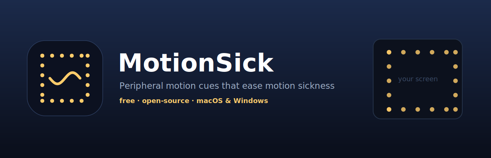

<div align="center">



<br/>

**Peripheral motion cues that ease motion sickness — the idea behind Apple's _Vehicle Motion Cues_, but cross-platform, configurable, and free.**

[](../../releases/latest)
[](../../actions)
[](../../releases/latest)
[](LICENSE)

[](https://ko-fi.com/technik_dev)

</div>

---

A tiny menu-bar / tray app that paints subtle, physics-driven dots around the
edges of your screen. They glide with the real motion you feel — vehicle
acceleration, tilt, scrolling — giving your eyes a peripheral signal that
**matches your inner ear**.

> 💙 **Free & open-source, for everyone.** Apple's motion cues need a brand-new
> OS and a device with the right sensors. MotionSick works on **any Mac (old or
> new) and Windows PC** — *with or without* a motion sensor: where a sensor
> exists it's used, and where it doesn't, the camera and scroll/pointer cues
> still help. Nobody should feel sick just because their hardware is a few years old.

---

## Why it helps

Motion sickness comes from **sensory conflict**: your inner ear feels motion
your eyes don't (reading in a car), or your eyes see motion your body doesn't
(scrolling, VR). MotionSick adds a calm field of dots in your peripheral vision
that **moves in sync with real motion**, closing that gap.

## Features

- 🎯 **Real-motion fusion** — blends every source your device exposes:
  - **Accelerometer / tilt** — the gravity vector, so a physical tilt (e.g. 30°)
    is reflected on screen, and vehicle braking/turns shift the field live.
  - **Camera optical flow** (macOS) — catches bumps and sway.
  - **Scroll & pointer** — the on-screen flow that itself causes screen sickness.
- 🌊 **Spring physics + momentum** — the field glides and settles, never jitters.
- ✨ **Apple-style fade & swell** — dots rest subtly and grow with motion.
- 🎨 **Fully customisable** — mode, intensity, speed, sensitivity, dot size,
  spacing, opacity, active edges, **custom colour**, and a warm comfort tint.
- 🔌 **Per-source toggles** — turn scrolling, pointer, camera or sensor on/off.
- 🪶 **Lightweight & private** — native, click-through overlay; camera frames are
  analysed on-device and never stored or sent anywhere.

## Download & install

Grab the latest build from **[Releases](../../releases/latest)**.

### macOS (11+ Apple Silicon & Intel, universal)
- **`.dmg`** — open it and drag **MotionSick** to Applications.
- **`.pkg`** — double-click to install.
- **First launch** (free & unsigned build): right-click the app → **Open**, then
  confirm. Look for the 〰️ icon in the menu bar. If macOS still blocks it:
  ```bash
  xattr -dr com.apple.quarantine /Applications/MotionSick.app
  ```

### Windows (10 / 11, x64)
- Unzip and run **`MotionSick.exe`** (self-contained — no .NET needed). It lives
  in the system tray.
- On the unsigned build SmartScreen may warn: **More info → Run anyway**.
- The real **tilt/accelerometer** works on laptops/tablets/convertibles that have
  a motion sensor; otherwise it falls back to mouse/scroll cues.

> Releases are signed & notarized automatically once the maintainer adds signing
> certificates — see [docs/SIGNING.md](docs/SIGNING.md).

## How the sensor logic works

| Source | What it senses | Best for |
|---|---|---|
| **Accelerometer** | Absolute **gravity/tilt** + lateral g | Trains, cars, tilting the device — *the real thing* |
| **Camera (optical flow)** | Relative scene motion | Bumps, sway, or aiming it out a window |
| **Scroll / pointer** | On-screen flow | Desk use, long reading/scrolling |

> The accelerometer is the hero in a vehicle: the whole device accelerates with
> the train/car, so braking, turns and tilt change the gravity vector directly.
> Macs that expose a sensor (Intel **Sudden Motion Sensor**) and Windows devices
> with a motion sensor get this natively. Apple-Silicon desktops/laptops don't
> expose an accelerometer, so there MotionSick fuses **camera + scroll/pointer**.

## Settings

Open **Settings…** from the menu-bar / tray icon. Every control updates the
overlay live. Each slider has an inline description; **Calibrate** zeroes the
current tilt as the neutral pose.

## Build from source

**macOS** (Xcode Command Line Tools):
```bash
./macos/package.sh        # builds .app, .dmg and .pkg into macos/dist/
# or just: ./macos/build.sh
```

**Windows** (.NET 8 SDK):
```powershell
dotnet publish windows/MotionSick.csproj -c Release -r win-x64 `
  --self-contained true -p:PublishSingleFile=true -o publish/win
```

CI (GitHub Actions) builds both on every tag and attaches them to the release.

## Support

If this made your commute bearable, you can support development on
**[Ko-fi ☕](https://ko-fi.com/technik_dev)**.

## License

[MIT](LICENSE) © technik_dev
